<div align="center">
  
</div>

<div align="center">
  <a href="https://gddao.com"></a>
  <a href="https://github.com/jerrylin1102/linebot-web"></a>
  <a href="https://github.com/jerrylin1102"></a>
</div>

## I build AI systems that survive beyond the demo.

I'm **Jerry Lin**, an AI Engineer at **Guppy Digital Technology Co., Ltd** and a full-stack developer who turns AI capabilities into complete, maintainable products.

I work on the development and ongoing operation of [**好事道 GDDAO**](https://gddao.com) — an organization trust AI platform — while continuously building independent projects. My strength is connecting the entire system: **agent harnesses, agent loops, RAG, tools, frontend, backend, data, cloud, and observability**.

> I don't stop at `model.generate()`. I care about what surrounds the model and makes it useful in the real world.

<details>
<summary><b>中文介紹</b></summary>
<br />

我是 **Jerry Lin**，目前任職於 **孔雀魚數位科技（Guppy Digital Technology Co., Ltd）** 擔任 AI 工程師，負責 [**好事道 GDDAO**](https://gddao.com) 的系統開發與持續維護。

我擅長與 AI 協作，將模型能力、RAG、工具呼叫與既有系統整合成完整的 Agent；同時具備全端開發經驗，能處理從前端、後端、資料庫，到網路、雲端部署與維運的完整生命週期。我畢業於 **銘傳大學資訊管理學系**，工作之外也會持續打造自己的產品與實驗。

</details>

## What I bring to a system

<table>
  <tr>
    <td width="33%" valign="top">
      <h3>🧠 Agentic AI</h3>
      <p>Designing the harness around the model: agent loops, tool orchestration, RAG, memory, guardrails, and evaluation.</p>
    </td>
    <td width="33%" valign="top">
      <h3>⚡ Product Engineering</h3>
      <p>Shipping web and mobile products end to end — interfaces, APIs, realtime flows, databases, integrations, and operations.</p>
    </td>
    <td width="33%" valign="top">
      <h3>☁️ Cloud Delivery</h3>
      <p>Turning working code into running systems across AWS and Cloudflare, with the infrastructure needed to keep them useful.</p>
    </td>
  </tr>
</table>

## Featured build

<a href="https://github.com/jerrylin1102/linebot-web">
  
</a>

**[BotCraft](https://github.com/jerrylin1102/linebot-web)** is a full-stack LINE Bot management platform that brings bot configuration, visual reply flows, Flex Message design, RAG knowledge, conversation records, broadcasting, and analytics into one operating surface.

This project represents how I like to build: not an isolated AI feature, but a product where **React + TypeScript**, **FastAPI + Python**, **PostgreSQL**, **MongoDB**, **Redis**, realtime communication, AI providers, and deployment concerns work as one system.

<div align="center">
  <a href="https://github.com/jerrylin1102/linebot-web"><b>Explore the repository →</b></a>
</div>

## My engineering loop

```ts
while (problem.isWorthSolving()) {
  const context = await understand(problem);
  const plan = await collaborate.withAI(context);

  const system = await build({
    agent: [harness, loop, tools, rag, evaluation],
    product: [frontend, backend, data, cloud],
  });

  await observe(system).then(improve).then(ship);
}
```

- **Models reason; harnesses make the reasoning dependable.**
- **Agents become useful when tools, memory, traces, and evaluation form a loop.**
- **An AI feature is only finished when people can use it and the team can operate it.**

## Working set

| Layer | Technologies |
| :--- | :--- |
| **Agentic AI** | `LLM` · `RAG` · `AI Agents` · `Harness Architecture` · `Agent Loop` · `Tool Integration` |
| **Frontend & Mobile** | `React` · `React Native` · `Vue` · `Flutter` |
| **Backend & Data** | `Python` · `NestJS` · `PostgreSQL` · `MongoDB` |
| **Infrastructure** | `Networking` · `Servers` · `Deployment` · `Operations` |
| **AWS** | `ECS` · `S3` · `Bedrock` · `SES` · `SQS` |
| **Cloudflare** | `Domains` · `R2` · `Pages` · `Workers` · `D1` |

## Current coordinates

- **Building & maintaining:** [好事道 GDDAO](https://gddao.com) at Guppy Digital Technology
- **Exploring:** reliable agent systems, better human–AI collaboration, and product-grade AI workflows
- **Background:** Information Management, Ming Chuan University
- **Open to:** exchanging ideas around agents, RAG, full-stack AI products, and system architecture

---

<div align="center">
  <sub><b>Have an AI idea that needs to become a real system?</b></sub><br />
  <a href="https://github.com/jerrylin1102/jerrylin1102/issues/new?title=Let%27s%20talk%20about%20AI%20systems">Start a conversation</a>
  &nbsp;·&nbsp;
  <a href="https://github.com/jerrylin1102?tab=repositories">Explore my repositories</a>
</div>
